# Kotlin-Native
Code base which shows the usage of Kotlin native framework to develop applications for both Android and IOS using Kotlin language

## Basics

### Why Kotlin/Native?

Kotlin/Native is primarily designed to allow compilation for platforms where virtual machines are not desirable or possible, for example, embedded devices or iOS. It solves the situations when a developer needs to produce a self-contained program that does not require an additional runtime or virtual machine.

#### Following are the advantages of using Kotlin Native in mobile applicatioon development.

* Unified business and presentational layers for multiple platforms.

* Unit testing of business logic at one place.

* Development time to develop multiplatform application is reduced.

#### Architecture for kotlin native projects 

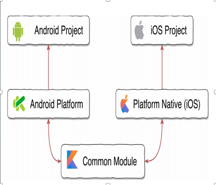

#### Datatype conversions followed specially for IOS framework:


### Target Platforms
 
Kotlin/Native supports the following platforms:

* iOS (arm32, arm64, simulator x86_64)
* MacOS (x86_64)
* Android (arm32, arm64)
* Windows (mingw x86_64, x86)
* Linux (x86_64, arm32, MIPS, MIPS little endian, Raspberry Pi)
* WebAssembly (wasm32)

## Project Configuration

First, start with configuring K/N project on Android Studio, ver 3.3 .

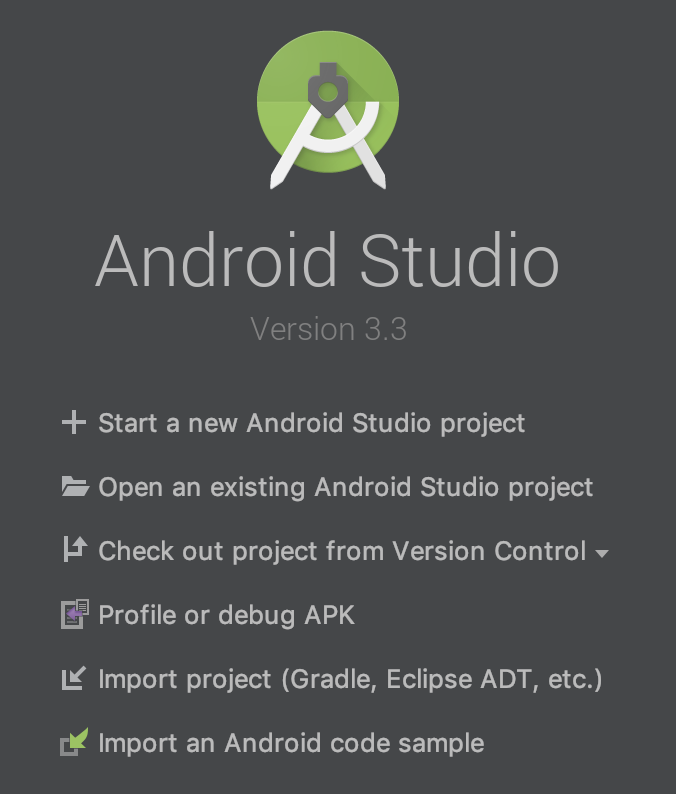

Click Start a new Android Studio project, select Empty Acticity .

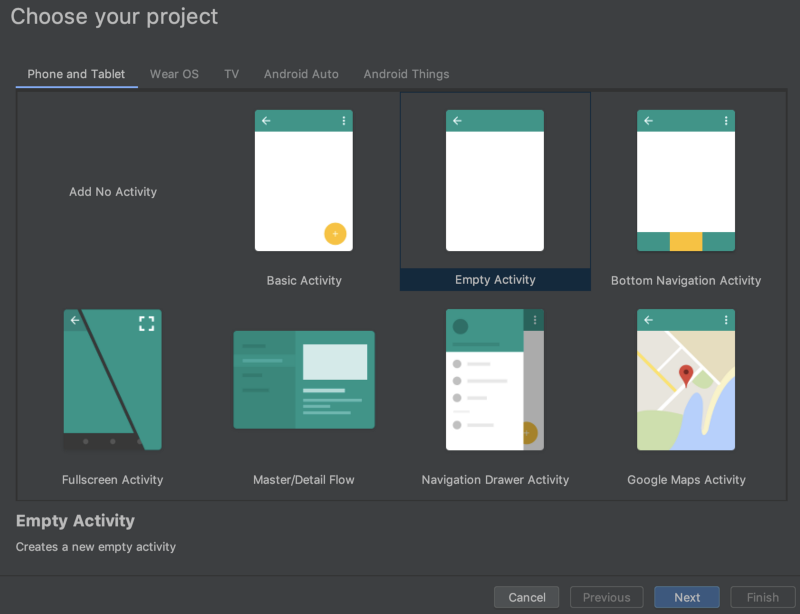

Next, input

* Application name, here KotlinNativeShared
* Package name
* Save location
* Language Kotlin
* Minimum API level, here API 28, but anything is ok.

Finished with the above setting.

The KotlinNativeiOS project will be opened automatically and gradle sync is performed. 

To setup directory, switch the Android tab to Project tab.

There are some directories and files. Like,

* .gradle/
* .idea/
* app/
* gradle/
* build.gradle
* etc..

```
Let’s take a look some files.

In build.gradle, ext.kotlin_version = '1.3.20' is written in buildscript . This shows we are using Kotlin version 1.3.20 apparently. Now, Kotlin version 1.3.21 is available. We use it, so replace the variable if needed.

In gradle/wrapper/gradle-wrapper.properties , distributionUrl is defined. In my case, gradle-4.10-1-all.zip are set.

Then, Sync Now button appears on top. Tap it and gradle sync will start.
```

### Creating the Shared Module

This section’s goal is to create an iOS framework from Kotlin codes.

Right click on KotlinNativeShared directory. And select New -> Directory.

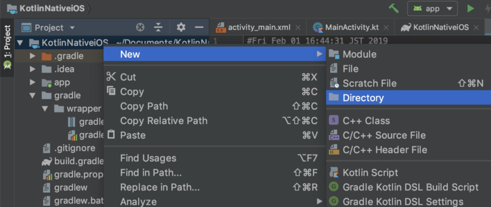

Input sharedNative (or any name you like). This directory will become shared module.


In the same way, create sharedNative/src/commonMain/kotlin directories.

And create common.kt file in kotlin directory. We define helloWorld function here as below.
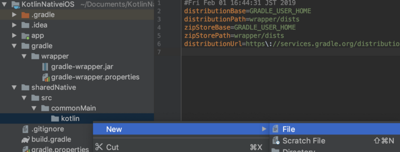

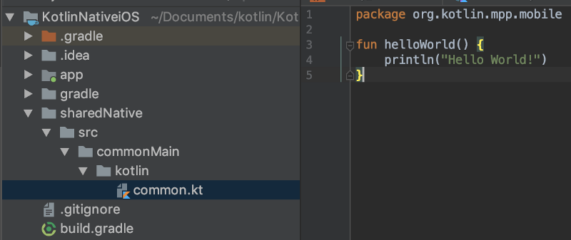

``` 
fun helloWorld() {
   println("Hello World!")
} 
```

We want to call this function from Swift. Let’s update the Gradle scripts.

First, we need to add the new project into the settings.gradle , simply adding the following line to the end.

``` 
include ':sharedNative'
```

```
Next, create the sharedNative/build.gradle .
```
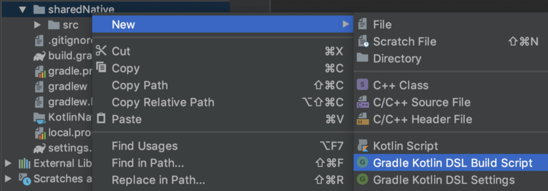
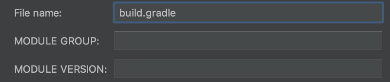

```
apply plugin: 'kotlin-multiplatform'
buildscript {
    ext.ios_framework_name = 'KotlinShared'
}
kotlin {
    targets {
        fromPreset(presets.iosX64, 'ios') {
            binaries {
                framework("$ios_framework_name") {
                    embedBitcode('disable')
                }
            }
        }
    }
    sourceSets {
        commonMain.dependencies {
            implementation 'org.jetbrains.kotlin:kotlin-stdlib-common'
        }
    }
}
```

This is a gradle script for using kotlin multiplatform. The presets is iosX64 , for ios simulator, here. If you want to build for ios device, change this presets to iosArm64 . Defining the following variable may be helpful.

```
final def iosTarget = System.getenv('SDK_NAME')?.startsWith("iphoneos") \
                              ? presets.iosArm64 : presets.iosX64
```


But, it’s ok. Go forward with presets.iosX64. You need Sync Now here.

We will create the framework.

Open terminal and move to KotlinNativeShared root directory, or use Android Studio’s Terminal to navigate to root directory.
```
./gradlew :sharedNative:build
```

gradlew command can run :Module ‘s :task . The above will perform building sharedNative module.
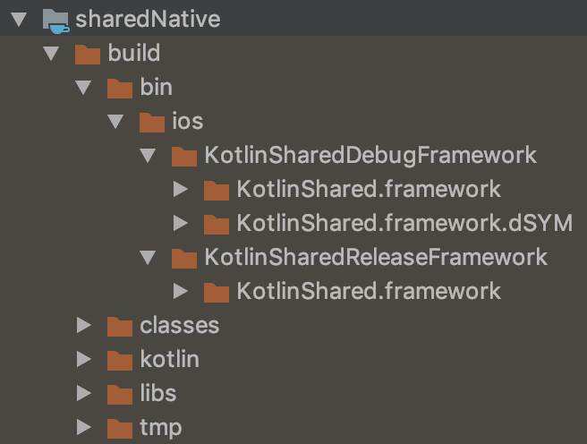

We found debug and release directories in sharedNative/build/bin/ios directory. Each has .framework in it. Frameworks are created 🎉.

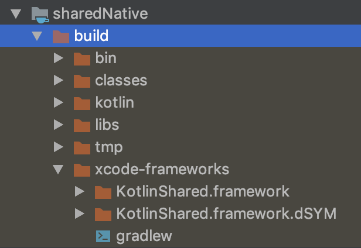

```
ext.ios_framework_name = 'KotlinShared'
```

We defined an above variable in build.gradle and set it to framework("$ios_framework_name") . The default name is main.framework without it.

You see .dSYM in same directory. Crashlytics or other services uses this debug symbol file to symbolicate crash logs. But it appears only for debug. For release, this issue is reported.

There is one more block you need. This is the task to pack a framework to Xcode. It’s not good for your Xcode project to directly refer to the framework in above debug or release directory because it has build configuration DEBUG or RELEASE . The framework reference should be changed depending on it.

The following task is for that. Define this task in sharedNative/build.gradle .
```
task packForXcode {
    final File frameworkDir = new File(buildDir, "xcode-frameworks")
    final String buildType = project.findProperty("XCODE_CONFIGURATION")?.toUpperCase() ?: 'DEBUG'

    def keyFrameworkPrefix = "$ios_framework_name${buildType.toLowerCase().capitalize()}"
    dependsOn "link${keyFrameworkPrefix}FrameworkIos"

    doLast {
        def srcFile = kotlin.targets.ios.binaries.getFramework("$ios_framework_name", buildType).outputFile

        copy {
            from srcFile.parent
            into frameworkDir
        }

        new File(frameworkDir, 'gradlew').with {
            text = "#!/bin/bash\nexport 'JAVA_HOME=${System.getProperty("java.home")}'\ncd '${rootProject.rootDir}'\n./gradlew \$@\n"
            setExecutable(true)
        }
    }
}

tasks.build.dependsOn packForXcode
```

In the same way, Sync Now and run this task.
```
./gradlew :sharedNative:packForXcode
```

This command performs the sharedNative module’s packForXcode task defined above.

Finally, xcode-frameworks directory and the framework appears. Xcode will refer this framework.

### Setting up shared library in IOS project

First, create KotlinNativeShared/ios directory and Xcode project with this configuration in it.

* Single View: Application
* Product Name: SampleiOS
* Language: Swift

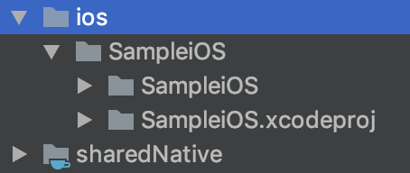

```
Like above, .xcodeproj path is relative to sharedNative directory (framework in it). The path is $SRCROOT/../../sharedNative . Using relative path, we can configure Xcode settings with environment variables.
```

Kotlin Native generates dynamic framework, so embed it to binaries.

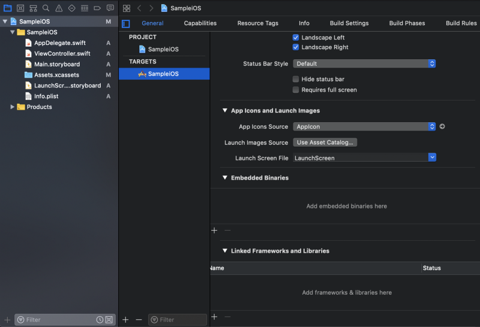

Move to Xcode project’s Generaltab. In Embedded Binaries section, tap + and click Add Other... Choose the framework in xcode-frameworks directory and create references.

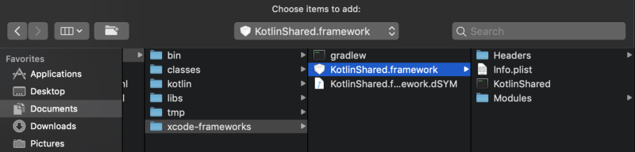
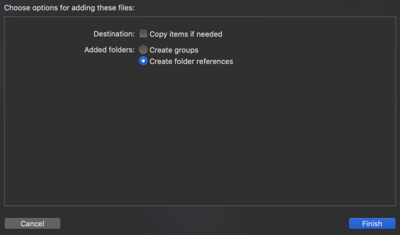
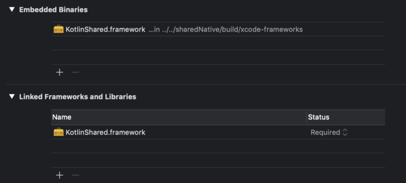

Finished embedding.

Now we need to add this path to Framework Search Path . Here, I use xcconfig file. Right click on SampleiOS group and choose Configuration Settings File

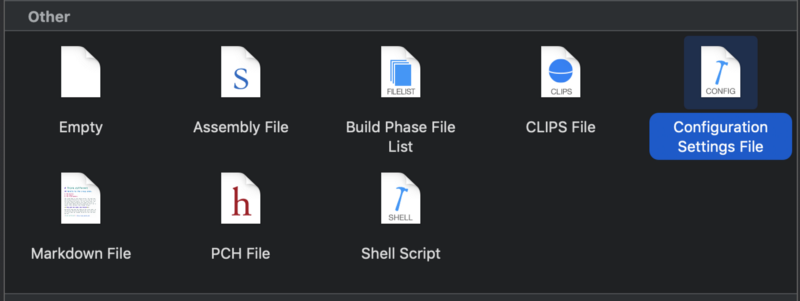

Config.xcconfig was created. Set the path.
```
FRAMEWORK_SEARCH_PATHS = $(inherited) $SRCROOT/../../sharedNative/build/xcode-frameworks
```

Tell your project which configuration file is used. If you have already set framework search path directly in Build Settings, replacing it to $(inherited) will reflect the xcconfig file’s setting.

Now we can use sharedNative framework. In ViewController.swift,
```
import UIKit
import KotlinShared

class ViewController: UIViewController {

 override func viewDidLoad() {
        super.viewDidLoad()
        
        CommonKt.helloWorld()
    }

}

```

#### packForXcode before Compile Sources in build phase

As I mentioned above, packForXcode is the gradle task to exchange the framework to the one built in proper configuration, DEBUG or RELEASE .

It should be run before compiling sources.

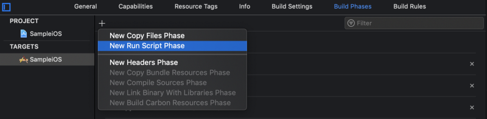

In Build Phases, add new run script phase. It is generated as Run Script. I renamed it to Kotlin/Native. The script is the following.
```
cd $SRCROOT/../../sharedNative/build/xcode-frameworks
./gradlew :sharedNative:packForXCode -PXCODE_CONFIGURATION=${CONFIGURATION}
```

Move the phase previous to the Compile Sources phase by dragging.

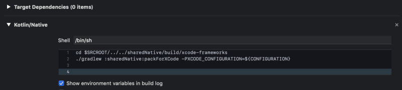

Check you can build successfully.

### iOS Specific Codes in Kotlin

We configured Kotlin Native project previously.

In this chapter, let’s create simple framework with Kotlin Native features.

First, create iosMain/kotlin/actual.kt directories and file in the same way as we did previously.

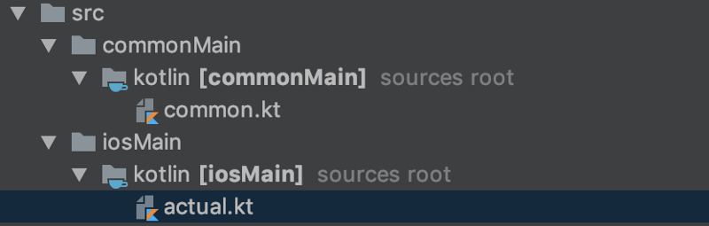

### Expect and Actual Functions

We sometimes want to separate behaviors on each platform. We can do that using expect and actual keywords

Now we can define helloWorld() depending upon the selected Platform.

#### in common.kt file
```
expect fun getPlatform(): String

fun sayHelloWorld() {
    println("Hello World ${getPlatform()} devs")
}
```

#### in iosActual.kt file
```
actual fun getPlatform(): String {
    return "IOS"
}
```

We used expect and actual . expect is available only in commonMain . The expect specified function’s behavior depends on each platform modules’ actual function.

If you don’t define actual function, this error appears. Safely.

```
Expected function 'getPlatform' has no actual declaration in module sharedNative_iOSMain for Native
```
```
expect and actual can also be used for class. This means expect annotation class is supported. This is important, especially for Android developers.
```

**_OptionalExpectation is available in case you don’t have to add annotation for specific platform._**

### Setting up shared library for Android

Setting up shared library is simple compared to set up in IOS.

Following steps needs to be performed while setting it up in Android:

* Click on the **_'publishAndroidPublicationToMavenLocal'_** task in Gradle task of KotlinNativeShared library.

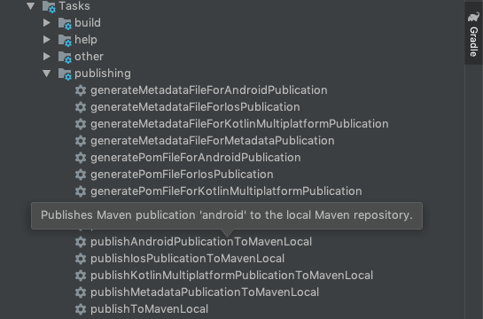

* Once the task is completed we will get the following binaries inside the **_'.m2'_** folder of your user directory

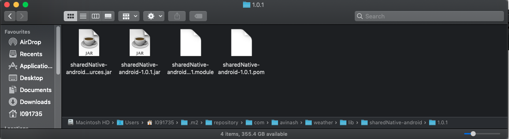

* Create a new Android project sync it. Navigate to the build.gradle file inside the app folder and add following dependencies and click on sync button: 
```
dependencies {
	....
	implementation 'com.avinash.weather.lib:sharedNative-android:1.0.1'
	....
}
```

* Once the sync task of android project is completed successfully you should now be good to use Kotlin Native library inside in your android application as shown in the following code snippet.
```
import sayHelloWorld

class MainActivity : AppCompatActivity() {
	 override fun onCreate(savedInstanceState: Bundle?) {
        super.onCreate(savedInstanceState)
        setContentView(R.layout.activity_main)
        println(sayHelloWorld())
    }
}
```

This will print **_'Hello World Android Devs!!'_** as the getPlatform() as described above will now be defined in androidActual.kt file with the following implementation:
#### in androidActual.kt file
```
actual fun getPlatform(): String {
    return "Android"
}
```


## Actual Application

Steps mentioned above were some of the prerequisites required for setting up Kotlin Native for both Android and IOS platforms.

We created a fully functional shared library containing network calls and presentation logic inside the shared library and UI implementation inside application code of respective libraries.

Following are the screenshots for both the platforms:

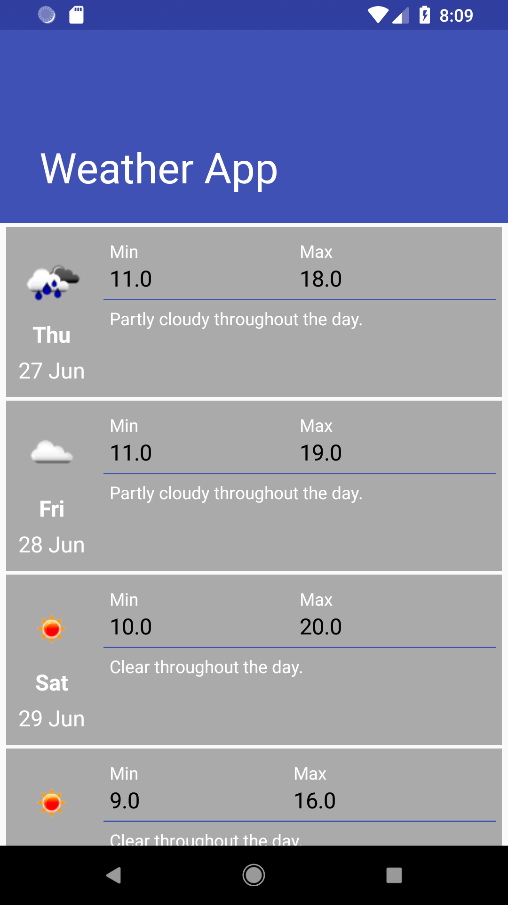 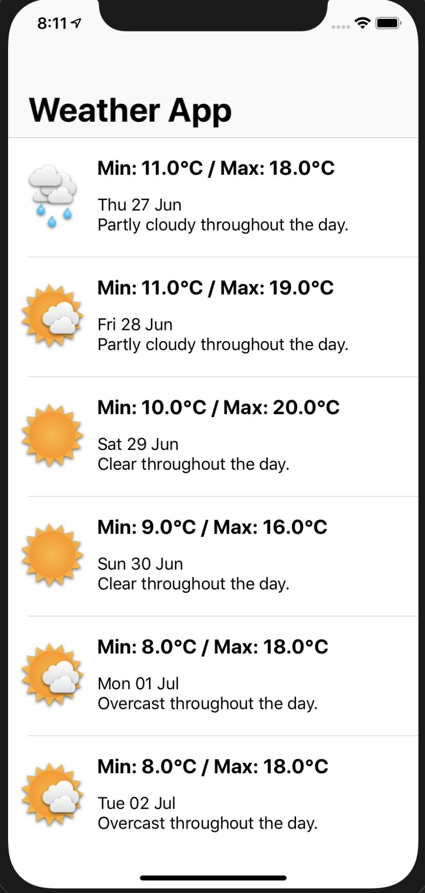
